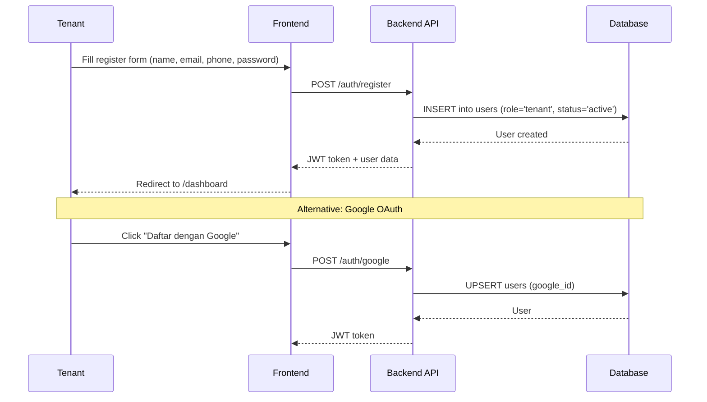
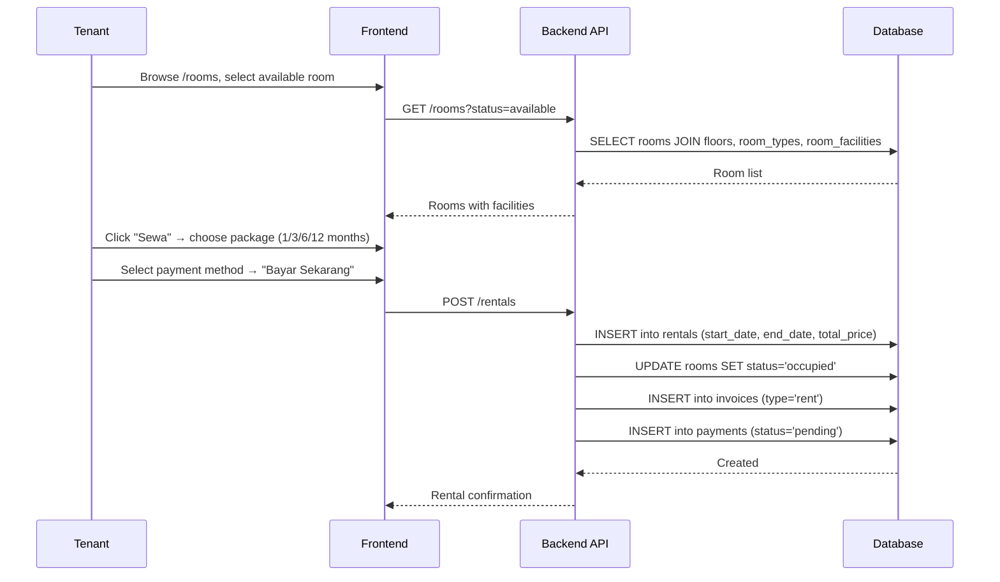
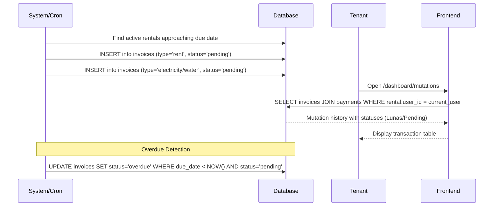
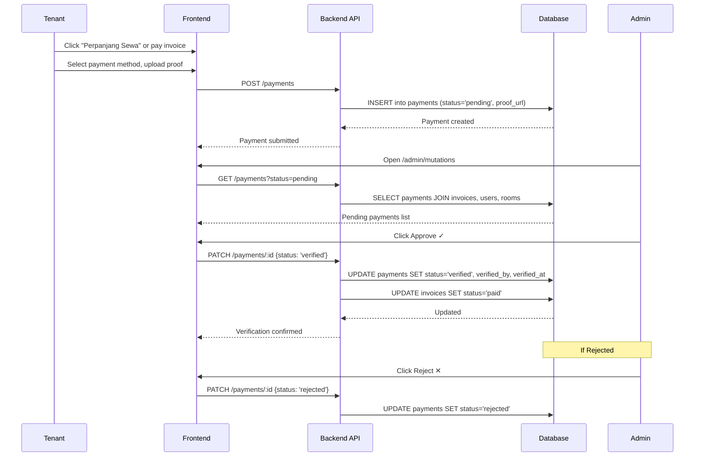
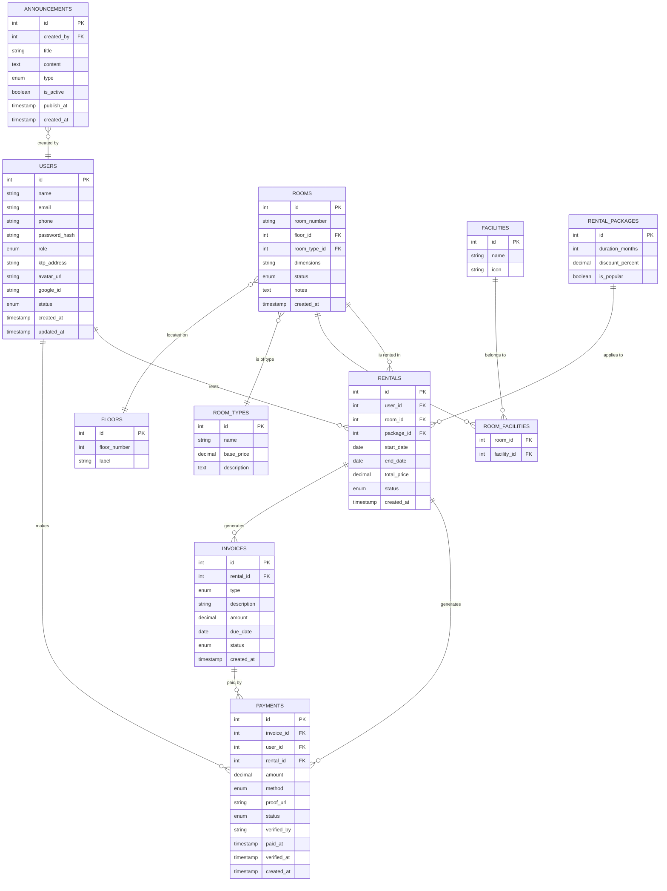

# OrchidCT Kos Management — Database Schema

This document proposes the complete database schema required by the OrchidCT Kos Management application, derived from scanning every frontend page, component, and flow in the current codebase.

---

## 1. Data Sources Scanned

| Area | Files Read |
|---|---|
| Auth | [AuthContext.jsx](file:///f:/Project/OrchidCT_VI-60C/frontend-react/src/context/AuthContext.jsx) |
| Public | [Landing.jsx](file:///f:/Project/OrchidCT_VI-60C/frontend-react/src/pages/public/Landing.jsx), [RoomAvailability.jsx](file:///f:/Project/OrchidCT_VI-60C/frontend-react/src/pages/public/RoomAvailability.jsx), [Login.jsx](file:///f:/Project/OrchidCT_VI-60C/frontend-react/src/pages/public/Login.jsx), [Register.jsx](file:///f:/Project/OrchidCT_VI-60C/frontend-react/src/pages/public/Register.jsx), [ForgotPassword.jsx](file:///f:/Project/OrchidCT_VI-60C/frontend-react/src/pages/public/ForgotPassword.jsx) |
| Tenant | [Overview.jsx](file:///f:/Project/OrchidCT_VI-60C/frontend-react/src/pages/tenant/Overview.jsx), [ActiveRent.jsx](file:///f:/Project/OrchidCT_VI-60C/frontend-react/src/pages/tenant/ActiveRent.jsx), [Profile.jsx](file:///f:/Project/OrchidCT_VI-60C/frontend-react/src/pages/tenant/Profile.jsx), [Mutations.jsx](file:///f:/Project/OrchidCT_VI-60C/frontend-react/src/pages/tenant/Mutations.jsx), [Renewal.jsx](file:///f:/Project/OrchidCT_VI-60C/frontend-react/src/pages/tenant/Renewal.jsx) |
| Admin | [Dashboard.jsx](file:///f:/Project/OrchidCT_VI-60C/frontend-react/src/pages/admin/Dashboard.jsx), [Users.jsx](file:///f:/Project/OrchidCT_VI-60C/frontend-react/src/pages/admin/Users.jsx), [Mutations.jsx](file:///f:/Project/OrchidCT_VI-60C/frontend-react/src/pages/admin/Mutations.jsx), [Monitoring.jsx](file:///f:/Project/OrchidCT_VI-60C/frontend-react/src/pages/admin/Monitoring.jsx) |

---

## 2. Collection Overview

The schema consists of **11 tables** grouped into 4 logical domains:

| Domain | Tables | Purpose |
|---|---|---|
| **Identity & Access** | `users` | User accounts for admins and tenants, authentication, profile data |
| **Property** | `floors`, `room_types`, `rooms`, `facilities`, `room_facilities` | Physical building structure — floors, room units, categories, and amenities |
| **Rental Lifecycle** | `rental_packages`, `rentals` | Rent contracts from booking through expiry, with duration-based pricing packages |
| **Financial** | `invoices`, `payments` | Billing (rent, electricity, water) and payment records with admin verification workflow |
| **Communication** | `announcements` | Property-wide notices and maintenance alerts from admin to tenants |

### Table Relationships at a Glance

- A **User** (tenant) → has many **Rentals** → each rental has many **Invoices** → each invoice has many **Payments**
- A **Room** → belongs to a **Floor** and a **Room Type** → has many **Facilities** (via junction table)
- A **Rental** → links one **User** to one **Room** for a time period, optionally using a **Rental Package**
- **Announcements** → created by admin **Users**, displayed on tenant dashboard

---

## 3. Data Flow

The following diagrams illustrate how data flows through the system for each core business process.

### 3.1 Registration & Authentication Flow

### 3.2 Room Rental Flow

### 3.3 Monthly Billing Cycle

### 3.4 Payment & Verification Flow

---

## 4. Entity Relationship Diagram

---

## 5. Detailed Table Definitions

### 5.1 `users`

Stores all app users (admins and tenants). Derived from: Register form, Login, AuthContext, Profile page, Admin Users page.

| Column | Type | Constraints | Description |
|---|---|---|---|
| `id` | `INT` | `PK, AUTO_INCREMENT` | Unique identifier |
| `name` | `VARCHAR(100)` | `NOT NULL` | Full name ("Nama Lengkap") |
| `email` | `VARCHAR(150)` | `NOT NULL, UNIQUE` | Login email |
| `phone` | `VARCHAR(20)` | `NULL` | Phone number ("Nomor HP") |
| `password_hash` | `VARCHAR(255)` | `NOT NULL` | Bcrypt-hashed password |
| `role` | `ENUM('admin','tenant')` | `NOT NULL, DEFAULT 'tenant'` | User role for access control |
| `ktp_address` | `TEXT` | `NULL` | Home address from ID card ("Alamat KTP") |
| `avatar_url` | `VARCHAR(500)` | `NULL` | Profile avatar image URL |
| `google_id` | `VARCHAR(100)` | `NULL, UNIQUE` | Google OAuth2 ID for social login |
| `status` | `ENUM('active','inactive','suspended')` | `NOT NULL, DEFAULT 'active'` | Account status |
| `created_at` | `TIMESTAMP` | `NOT NULL, DEFAULT NOW()` | Registration date |
| `updated_at` | `TIMESTAMP` | `NOT NULL, DEFAULT NOW(), ON UPDATE NOW()` | Last profile update |

> [!NOTE]
> The Register form collects `name`, `email`, `phone`, `password`. The Profile page additionally shows `ktp_address`. The "Daftar dengan Google" button requires `google_id` for OAuth.

---

### 5.2 `floors`

Lookup table for building floors. Derived from: Room Availability boards, Monitoring page.

| Column | Type | Constraints | Description |
|---|---|---|---|
| `id` | `INT` | `PK, AUTO_INCREMENT` | Unique identifier |
| `floor_number` | `INT` | `NOT NULL, UNIQUE` | Floor number (1, 2, 3…) |
| `label` | `VARCHAR(30)` | `NOT NULL` | Display label ("Lantai 1") |

---

### 5.3 `room_types`

Defines categories of rooms with base pricing. Derived from: Room Availability header ("Tipe Kamar Standard", Rp 1.200.000/bulan).

| Column | Type | Constraints | Description |
|---|---|---|---|
| `id` | `INT` | `PK, AUTO_INCREMENT` | Unique identifier |
| `name` | `VARCHAR(50)` | `NOT NULL, UNIQUE` | Type name (e.g., "Standard", "Deluxe") |
| `base_price` | `DECIMAL(12,2)` | `NOT NULL` | Monthly base price in IDR |
| `description` | `TEXT` | `NULL` | Additional description |

---

### 5.4 `rooms`

Individual room units in the kos building. Derived from: Room Availability grid, Admin Monitoring, Active Rent page.

| Column | Type | Constraints | Description |
|---|---|---|---|
| `id` | `INT` | `PK, AUTO_INCREMENT` | Unique identifier |
| `room_number` | `VARCHAR(10)` | `NOT NULL, UNIQUE` | Room number ("101", "205") |
| `floor_id` | `INT` | `FK → floors.id, NOT NULL` | Which floor the room is on |
| `room_type_id` | `INT` | `FK → room_types.id, NOT NULL` | Room category |
| `dimensions` | `VARCHAR(20)` | `NULL` | Room size (e.g., "3x4 meter") |
| `status` | `ENUM('available','occupied','maintenance')` | `NOT NULL, DEFAULT 'available'` | Current room status |
| `notes` | `TEXT` | `NULL` | Admin notes (e.g., "Jendela hadap timur", "Sinyal WiFi Kuat") |
| `created_at` | `TIMESTAMP` | `NOT NULL, DEFAULT NOW()` | Date room was added |

> [!IMPORTANT]
> Room `status` is a **derived/cached** value computed from active rentals and admin flags. The values `occupied` and `overdue` in the Monitoring page can be derived from rental data, while `maintenance` is explicitly set by admin.

---

### 5.5 `facilities`

Master list of room facilities/amenities. Derived from: Room Availability (WiFi, AC, Kamar Mandi, Springbed) and Active Rent page (6 facilities listed).

| Column | Type | Constraints | Description |
|---|---|---|---|
| `id` | `INT` | `PK, AUTO_INCREMENT` | Unique identifier |
| `name` | `VARCHAR(80)` | `NOT NULL, UNIQUE` | Facility name (e.g., "WiFi Gratis") |
| `icon` | `VARCHAR(50)` | `NULL` | Material icon name (e.g., "wifi", "ac_unit") |

**Seed data** (from the frontend):
- WiFi Gratis (`wifi`)
- AC Dingin (`ac_unit`)
- Kamar Mandi Dalam (`bathtub`)
- Kasur Springbed (`bed`)
- Meja Kerja
- Lemari Pakaian

---

### 5.6 `room_facilities` (junction table)

Many-to-many relationship between rooms and facilities.

| Column | Type | Constraints | Description |
|---|---|---|---|
| `room_id` | `INT` | `FK → rooms.id, NOT NULL` | Room reference |
| `facility_id` | `INT` | `FK → facilities.id, NOT NULL` | Facility reference |
| | | `PK (room_id, facility_id)` | Composite primary key |

---

### 5.7 `rental_packages`

Pricing packages for rent duration. Derived from: Tenant Renewal page.

| Column | Type | Constraints | Description |
|---|---|---|---|
| `id` | `INT` | `PK, AUTO_INCREMENT` | Unique identifier |
| `duration_months` | `INT` | `NOT NULL` | Duration in months (1, 3, 6, 12) |
| `discount_percent` | `DECIMAL(5,2)` | `NOT NULL, DEFAULT 0` | Discount percentage (0, 5, 10, 15) |
| `is_popular` | `BOOLEAN` | `NOT NULL, DEFAULT FALSE` | Highlighted as recommended |

**Seed data** (from the frontend):

| Duration | Discount | Popular |
|---|---|---|
| 1 month | 0% | No |
| 3 months | 5% | **Yes** |
| 6 months | 10% | No |
| 12 months | 15% | No |

---

### 5.8 `rentals`

Active and historical rent contracts. Derived from: Tenant Overview, Active Rent, Admin Users, Admin Monitoring.

| Column | Type | Constraints | Description |
|---|---|---|---|
| `id` | `INT` | `PK, AUTO_INCREMENT` | Unique identifier |
| `user_id` | `INT` | `FK → users.id, NOT NULL` | Tenant who rents |
| `room_id` | `INT` | `FK → rooms.id, NOT NULL` | Room being rented |
| `package_id` | `INT` | `FK → rental_packages.id, NULL` | Selected rental package |
| `start_date` | `DATE` | `NOT NULL` | Rental start date ("Mulai Sewa") |
| `end_date` | `DATE` | `NOT NULL` | Rental end date ("Berakhir") |
| `total_price` | `DECIMAL(12,2)` | `NOT NULL` | Total price after discounts |
| `status` | `ENUM('active','expired','cancelled','renewed')` | `NOT NULL, DEFAULT 'active'` | Rental lifecycle status |
| `created_at` | `TIMESTAMP` | `NOT NULL, DEFAULT NOW()` | Date contract was created |

> [!NOTE]
> On the Overview page, "Sisa Durasi" (remaining days) and "Jatuh Tempo" (due date) are **computed** from `end_date`. The "overdue" flag on Monitoring is computed as `end_date < CURRENT_DATE AND status = 'active'`.

---

### 5.9 `invoices`

Bills generated for tenants — rent, electricity, water. Derived from: Tenant Mutations table, Activity feed, Admin Mutations.

| Column | Type | Constraints | Description |
|---|---|---|---|
| `id` | `INT` | `PK, AUTO_INCREMENT` | Unique identifier |
| `rental_id` | `INT` | `FK → rentals.id, NOT NULL` | Associated rental contract |
| `type` | `ENUM('rent','electricity','water','other')` | `NOT NULL` | Invoice category ("Sewa Bulanan", "Tagihan Listrik", "Tagihan Air") |
| `description` | `VARCHAR(255)` | `NULL` | Human-readable description (e.g., "Sewa Kamar 102 - Oktober 2023") |
| `amount` | `DECIMAL(12,2)` | `NOT NULL` | Billed amount in IDR |
| `due_date` | `DATE` | `NOT NULL` | Payment due date |
| `status` | `ENUM('pending','paid','overdue','cancelled')` | `NOT NULL, DEFAULT 'pending'` | Invoice status ("Lunas", "Pending") |
| `created_at` | `TIMESTAMP` | `NOT NULL, DEFAULT NOW()` | Date invoice was generated |

---

### 5.10 `payments`

Payment records and verification flow. Derived from: Tenant Mutations (amount, method, status), Renewal (payment methods), Admin Mutations (verify/reject actions), Admin Dashboard (recent activity with amounts and statuses).

| Column | Type | Constraints | Description |
|---|---|---|---|
| `id` | `INT` | `PK, AUTO_INCREMENT` | Unique identifier |
| `invoice_id` | `INT` | `FK → invoices.id, NOT NULL` | Invoice being paid |
| `user_id` | `INT` | `FK → users.id, NOT NULL` | Tenant who paid |
| `rental_id` | `INT` | `FK → rentals.id, NOT NULL` | Rental contract reference |
| `amount` | `DECIMAL(12,2)` | `NOT NULL` | Amount paid |
| `method` | `ENUM('transfer_bca','transfer_mandiri','qris')` | `NOT NULL` | Payment method |
| `proof_url` | `VARCHAR(500)` | `NULL` | Upload URL for transfer proof |
| `status` | `ENUM('pending','verified','rejected')` | `NOT NULL, DEFAULT 'pending'` | Verification status |
| `verified_by` | `INT` | `FK → users.id, NULL` | Admin who verified/rejected |
| `paid_at` | `TIMESTAMP` | `NULL` | When the tenant submitted payment |
| `verified_at` | `TIMESTAMP` | `NULL` | When admin verified or rejected |
| `created_at` | `TIMESTAMP` | `NOT NULL, DEFAULT NOW()` | Record creation date |

> [!IMPORTANT]
> The Admin Mutations page has **Approve** (✓) and **Reject** (✕) buttons for pending payments. This workflow updates both `payments.status` and the corresponding `invoices.status`.

---

### 5.11 `announcements`

Property-wide notices. Derived from: Tenant Overview info card ("Info Pemeliharaan" — planned maintenance notices).

| Column | Type | Constraints | Description |
|---|---|---|---|
| `id` | `INT` | `PK, AUTO_INCREMENT` | Unique identifier |
| `created_by` | `INT` | `FK → users.id, NOT NULL` | Admin who posted |
| `title` | `VARCHAR(150)` | `NOT NULL` | Announcement title |
| `content` | `TEXT` | `NOT NULL` | Full announcement body |
| `type` | `ENUM('info','maintenance','urgent')` | `NOT NULL, DEFAULT 'info'` | Category for display styling |
| `is_active` | `BOOLEAN` | `NOT NULL, DEFAULT TRUE` | Whether currently visible |
| `publish_at` | `TIMESTAMP` | `NULL` | Scheduled publish date |
| `created_at` | `TIMESTAMP` | `NOT NULL, DEFAULT NOW()` | Date created |

---

## 6. Indexes & Performance Considerations

| Table | Index | Columns | Rationale |
|---|---|---|---|
| `users` | `idx_users_email` | `email` | Login lookup, uniqueness |
| `users` | `idx_users_google_id` | `google_id` | OAuth login lookup |
| `rooms` | `idx_rooms_floor` | `floor_id` | Filter rooms by floor |
| `rooms` | `idx_rooms_status` | `status` | Monitoring page filter |
| `rentals` | `idx_rentals_user` | `user_id` | Tenant dashboard queries |
| `rentals` | `idx_rentals_room` | `room_id` | Room occupancy lookup |
| `rentals` | `idx_rentals_status_enddate` | `status, end_date` | Active/overdue filtering |
| `invoices` | `idx_invoices_rental` | `rental_id` | Mutation history per tenant |
| `invoices` | `idx_invoices_status` | `status` | Pending/overdue filtering |
| `payments` | `idx_payments_invoice` | `invoice_id` | Join with invoices |
| `payments` | `idx_payments_status` | `status` | Admin approval queue |

---

## 7. Summary Statistics (How the schema supports each page)

| Page | Primary Tables Used |
|---|---|
| **Landing** | `room_types`, `facilities`, `rooms` (availability count) |
| **Room Availability** | `rooms`, `floors`, `room_types`, `room_facilities`, `facilities` |
| **Register / Login** | `users` |
| **Tenant Overview** | `rentals` (active), `invoices` (recent), `announcements` |
| **Tenant Active Rent** | `rentals`, `rooms`, `room_types`, `room_facilities`, `facilities` |
| **Tenant Profile** | `users` |
| **Tenant Mutations** | `invoices`, `payments` (filtered by current user's rental) |
| **Tenant Renewal** | `rental_packages`, `rentals` (new insert), `payments` |
| **Admin Dashboard** | `users` (count), `rooms` (occupancy), `payments` (revenue, recent), `invoices` (pending tasks) |
| **Admin Users** | `users`, `rentals`, `rooms` (joined for room display) |
| **Admin Mutations** | `payments`, `invoices`, `users`, `rooms` (verification workflow) |
| **Admin Monitoring** | `rooms`, `rentals`, `users` (occupancy + due dates) |

---

## 8. ENUM Value Reference

| ENUM | Values | Source |
|---|---|---|
| `users.role` | `admin`, `tenant` | AuthContext `allowedRole` prop |
| `users.status` | `active`, `inactive`, `suspended` | Admin Users "Aktif" / future states |
| `rooms.status` | `available`, `occupied`, `maintenance` | Monitoring `statusConfig` + Room Availability |
| `rentals.status` | `active`, `expired`, `cancelled`, `renewed` | Overview "Status Sewa Aktif" + lifecycle |
| `invoices.type` | `rent`, `electricity`, `water`, `other` | Mutations "Sewa Bulanan", "Tagihan Listrik", "Tagihan Air" |
| `invoices.status` | `pending`, `paid`, `overdue`, `cancelled` | Mutations "Lunas", "Pending" |
| `payments.method` | `transfer_bca`, `transfer_mandiri`, `qris` | Renewal page payment methods |
| `payments.status` | `pending`, `verified`, `rejected` | Admin Mutations approve/reject flow |
| `announcements.type` | `info`, `maintenance`, `urgent` | Overview info card styling |
